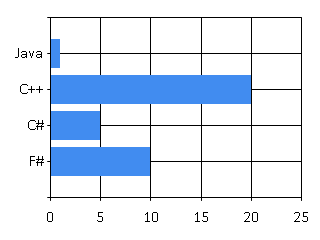
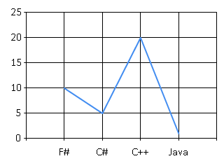
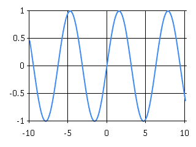
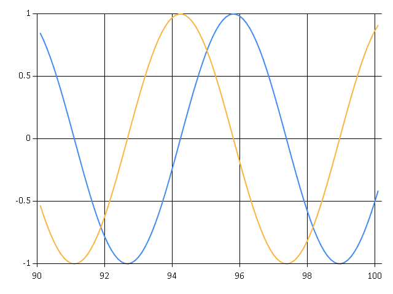

# IPython notebook backed by an F# kernel

## Examples

    "Last value displayed"

    val it : string = "Last value displayed"

    errors are displayed

    input.fsx(1,1): error FS0039: The value or constructor 'errors' is not defined

## Utility Methods

    Util.Html("<b>Inline HTML</b>") |> Display

<b>Inline HTML</b>

    Util.Url("http://upload.wikimedia.org/wikipedia/en/9/93/FSharp_Logo.png") |> Display

    {ContentType = "image/png";
     Data =
      [|137uy; 80uy; 78uy; 71uy; 13uy; 10uy; 26uy; 10uy; 0uy; 0uy; 0uy; 13uy; 73uy;
        72uy; 68uy; 82uy; 0uy; 0uy; 1uy; 55uy; 0uy; 0uy; 0uy; 212uy; 8uy; 6uy; 0uy;
        0uy; 0uy; 249uy; 133uy; 100uy; 170uy; 0uy; 0uy; 0uy; 6uy; 98uy; 75uy; 71uy;
        68uy; 0uy; 255uy; 0uy; 255uy; 0uy; 255uy; 160uy; 189uy; 167uy; 147uy; 0uy;
        0uy; 0uy; 9uy; 112uy; 72uy; 89uy; 115uy; 0uy; 0uy; 14uy; 195uy; 0uy; 0uy;
        14uy; 195uy; 1uy; 199uy; 111uy; 168uy; 100uy; 0uy; 0uy; 0uy; 7uy; 116uy;
        73uy; 77uy; 69uy; 7uy; 221uy; 2uy; 11uy; 22uy; 23uy; 28uy; 198uy; 156uy;
        118uy; 43uy; 0uy; 0uy; 32uy; 0uy; 73uy; 68uy; 65uy; 84uy; 120uy; ...|];}

    

    Util.Math("f(x) = sin(x)") |> Display

$$f(x) = sin(x)$$

    let data = [ ("F#", 10); ("C#", 5); ("C++", 20); ("Java", 1); ]
    Util.Table(data) |> Display

<table><thead><tr><th>Item1</th><th>Item2</th></tr></thead><tbody><tr><td>F#</td><td>10</td></tr><tr><td>C#</td><td>5</td></tr><tr><td>C++</td><td>20</td></tr><tr><td>Java</td><td>1</td></tr><tbody></tbody></table>

## F# Charting

    Chart.Bar(data) |> Display

    Chart.Line(data) |> Display

## Random things

    let linspace (min : float, max : float, dx : float) =
        if min > max then failwith (sprintf "min [%f] cannot be greater than max [%f]" min max)
        if dx = 0.0 then failwith ("dx cannot be zero")
        
        let x = ref min
        seq {
            while !x < max do
                x := !x + dx
                yield !x
        }

    let plot (data:seq<float>, cb) =
        let results = 
            seq {
                for x in data do
                    yield (x, cb(x))
            }
    
        Chart.Line (results)

    let x = linspace (-10.0, 10.0, 0.1)
    plot(x, fun y -> sin(y)) |> Display
    Util.Math "f(x) = sin(x)" |> Display

$$f(x) = sin(x)$$

    

    (** This actually does animation when running *)
    open System.Threading
    
    for i in 1 .. 100 do
    
        Clear() |> ignore
    
        let x = linspace(-10.0 + float(i), float(i), 0.1) |> Seq.toArray
        let c1 = plot(x, sin)
        let c2 = plot(x, cos)
    
        Chart.Combine([c1; c2])
        |> Chart.WithSize(640, 480)
        |> Display
        |> ignore
        
        Thread.Sleep(20)
        

    
